# Module 0 - Lab environment setup

Time to complete: 120 minutes

This module helps learners prepare their lab environments for the modules that follow. Please run through these instructions prior to starting Module 1.

## Lab details

- [Module 0 - Lab environment setup](#module-0---lab-environment-setup)
  - [Lab details](#lab-details)
  - [Requirements](#requirements)
  - [Exercise 1: Azure setup](#exercise-1-azure-setup)
    - [Task 1: Register resource providers](#task-1-register-resource-providers)
    - [Task 2: Create a resource group in Azure](#task-2-create-a-resource-group-in-azure)
    - [Task 3: Create an Azure VM for the deployment scripts and desktop applications](#task-3-create-an-azure-vm-for-the-deployment-scripts-and-desktop-applications)
    - [Task 4: Create Azure resources](#task-4-create-azure-resources)
  - [Exercise 2: Setup Synapse Analytics workspace](#exercise-2-setup-synapse-analytics-workspace)
    - [Task 1: Pre-requisites](#task-1-pre-requisites)
    - [Task 2: Download artifacts and install PowerShell modules](#task-2-download-artifacts-and-install-powershell-modules)
    - [Task 3: Execute setup scripts](#task-3-execute-setup-scripts)
    - [Task 4: Create an Azure Databricks cluster](#task-4-create-an-azure-databricks-cluster)

## Requirements

1. An Azure Account with the ability to create an Azure Synapse Workspace

## Exercise 1: Azure setup

### Task 1: Register resource providers

Time to complete: 3 minutes

In Azure, you must register specific resource providers on your subscription before you can deploy services such as Synapse Analytics and Azure Databricks.

1. Log in to the Azure portal (<https://portal.azure.com>).

2. In the search bar on top of the page, type `subscriptions` and select **Subscriptions** in the results.

    

3. Select the Azure subscription you will use for your lab environment.

    

4. Select **Resource providers** in the left-hand menu.

    

5. In the **filter**, type `databricks` to view the **Microsoft.Databricks** provider. Make sure the status is set to **Registered**.

    

    If it is **not** registered, select the **Microsoft.Databricks** resource provider, then select **Register**.

    

6. In the **filter**, type `synapse` to view the **Microsoft.Synapse** provider. Make sure the status is set to **Registered**.

    

    If it is **not** registered, select the **Microsoft.Synapse** resource provider, then select **Register**.

    

7. In the **filter**, type `sql` to view the **Microsoft.Sql** provider. Make sure the status is set to **Registered**.

    

    If it is **not** registered, select the **Microsoft.Sql** resource provider, then select **Register**.

    

8. In the **filter**, type `document` to view the **Microsoft.DocumentDB** provider. Make sure the status is set to **Registered**.

    

    If it is **not** registered, select the **Microsoft.DocumentDB** resource provider, then select **Register**.

    

9. In the **filter**, type `stream` to view the **Microsoft.StreamAnalytics** provider. Make sure the status is set to **Registered**.

    

    If it is **not** registered, select the **Microsoft.StreamAnalytics** resource provider, then select **Register**.

    

10. In the **filter**, type `event` to view the **Microsoft.EventHub** provider. Make sure the status is set to **Registered**.

    

    If it is **not** registered, select the **Microsoft.EventHub** resource provider, then select **Register**.

    

11. In the **filter**, type `keyvault` to view the **Microsoft.KeyVault** provider. Make sure the status is set to **Registered**.

    

    If it is **not** registered, select the **Microsoft.KeyVault** resource provider, then select **Register**.

    

12. In the **filter**, type `storage` to view the **Microsoft.Storage** provider. Make sure the status is set to **Registered**.

    

    If it is **not** registered, select the **Microsoft.Storage** resource provider, then select **Register**.

    

13. In the **filter**, type `compute` to view the **Microsoft.Compute** provider. Make sure the status is set to **Registered**.

    

    If it is **not** registered, select the **Microsoft.Compute** resource provider, then select **Register**.

    


### Task 2: Create a resource group in Azure

1. Log into the [Azure Portal](https://portal.azure.com) using your Azure credentials.

2. On the Azure Portal home screen, select the **Menu** button on the top-left corner **(1)**. Hover over **Resource groups (2)**, then select **+ Create (3)**.

    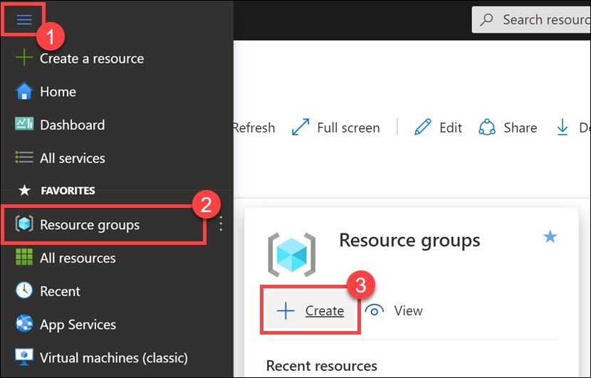

3. On the **Create a resource group** screen, select your desired Subscription and Region. For Resource group, enter **`data-engineering-synapse`** (make sure the name is unique), then select the **Review + Create** button. **Copy the resource group name** and save it in Notepad or similar for later reference.

    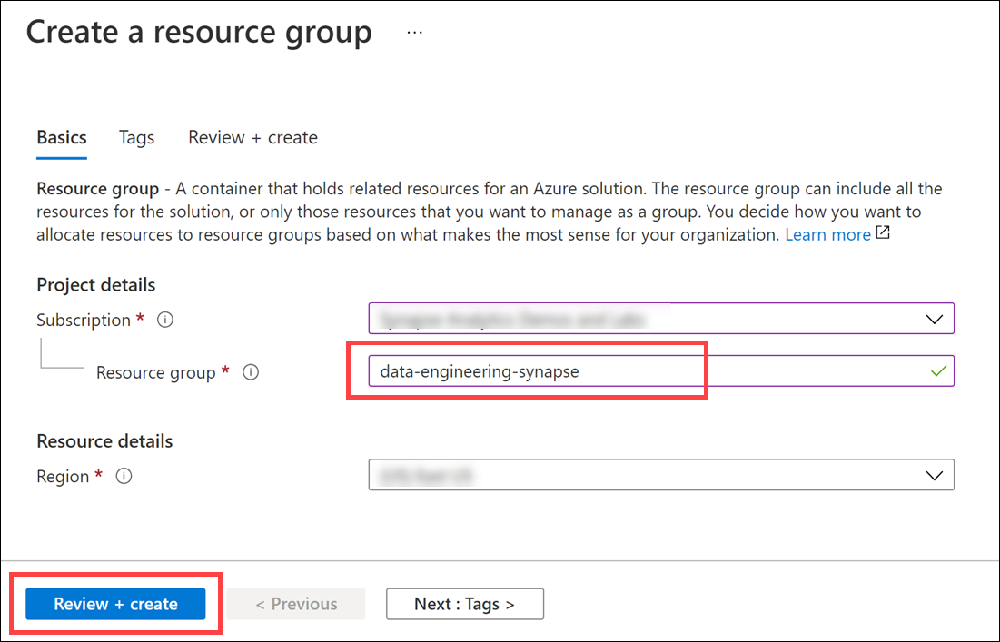

4. Select the **Create** button once validation has passed.

> **Important**: Take note of the _exact_ resource group name you provided for the steps that follow.

### Task 3: Create an Azure VM for the deployment scripts and desktop applications

We highly recommend executing the PowerShell scripts on an Azure Virtual Machine instead of from your local machine. Doing so eliminates issues due to pre-existing dependencies and more importantly, network/bandwidth-related issues while executing the scripts.

1. In the [Azure portal](https://portal.azure.com), type in "virtual machines" in the top search menu and then select **Virtual machines** from the results.

    

2. Select **+ Add** on the Virtual machines page and then select the **Virtual machine** option.

3. In the **Basics** tab, complete the following:

   | Field                          | Value                                              |
   | ------------------------------ | ------------------------------------------         |
   | Subscription                   | _select the appropriate subscription_              |
   | Resource group                 | _select `data-engineering-synapse` (the name of the resource group you created in the previous task)_                      |
   | Virtual machine name           | _`data-engineering-lab-vm` (or unique name if not available)_      |
   | Region                         | _select the resource group's location_             |
   | Availability options           | _select `No infrastructure redundancy required`_   |
   | Image                          | _select `Windows 10 Pro, Version 20H2 - Gen1` (or newer)_     |
   | Azure Spot instance            | _set to `Unchecked`_                                      |
   | Size                           | _select `Standard_D8s_v3`_                         |
   | Username                       | _select `labuser`_                             |
   | Password                       | _enter a password you will remember_               |
   | Public inbound ports           | _select `Allow selected ports`_                    |
   | Select inbound ports           | _select `RDP (3389)`_                              |
   | Licensing                      | _select the option to confirm that you have an  eligible Windows 10 license with multi-tenant hosting rights._ |

   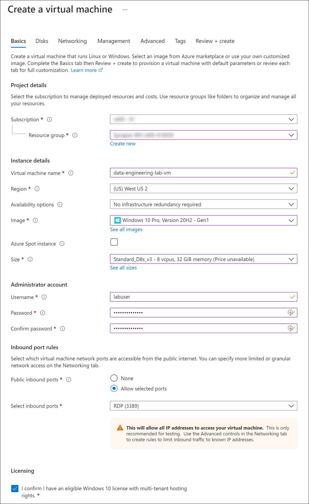

4. Select **Review + create**. On the review screen, select **Create**. After the deployment completes, select **Go to resource** to go to the virtual machine.

    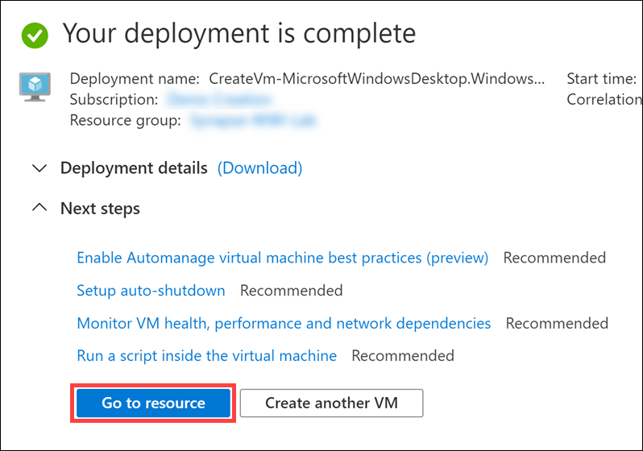

5. Select **Connect** from the actions menu and choose **RDP**.

    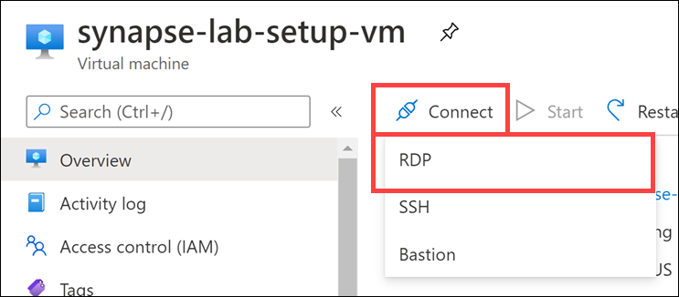

6. On the **Connect** tab, select **Download RDP File**.

    

7. Open the RDP file and select **Connect** to access the virtual machine. When prompted for credentials, enter `labuser` for the username and the password you chose.

    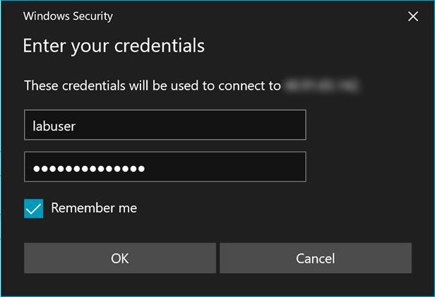

    Click Yes to connect despite security certificate errors when prompted.

    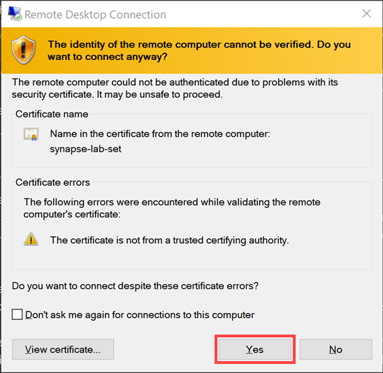

8. Install [Power BI Desktop](https://www.microsoft.com/download/details.aspx?id=58494) on the VM.

### Task 4: Create Azure resources

Time to complete: 6 minutes

The below ARM template deploys several Azure resources for the labs, including Azure Synapse Analytics, Azure Databricks, storage accounts, Event Hubs, Stream Analytics, Key Vault, Azure Cosmos DB, etc.

1. Deploy the workspace through the following Azure ARM template (select the button below):

    <a href="https://portal.azure.com/#create/Microsoft.Template/uri/https%3A%2F%2Fraw.githubusercontent.com%2Fsolliancenet%2Fdp-203-v2%2Fmain%2FInstructions%2FLabs%2F00%2Fartifacts%2Fenvironment-setup%2fautomation%2F00-asa-workspace-core.json" target="_blank"></a>

2. On the **Custom deployment** form fill in the fields described below.

   - **Subscription**: Select your desired subscription for the deployment.
   - **Resource group**: Select the resource group you previously created.
   - **Region**: The region where your Azure Synapse environment will be created.

        > **Important**: The `Region` field under 'Parameters' will list the Azure regions where Azure Synapse Analytics is available as of November 2020. This will help you find a region where the service is available without being limited to where the resource group is defined.

   - **Unique Suffix**: This unique suffix will be used naming resources that will created as part of your deployment, such as your initials followed by the current date in YYYYMMDD format (ex. `jdh20210615`). Make sure you follow correct Azure [Resource naming](https://docs.microsoft.com/en-us/azure/cloud-adoption-framework/ready/azure-best-practices/naming-and-tagging#resource-naming) conventions.
   - **SQL Administrator Login Password**: Provide a strong password for the SQLPool that will be created as part of your deployment. [Visit here](https://docs.microsoft.com/en-us/sql/relational-databases/security/password-policy?view=sql-server-ver15#password-complexity) to read about password rules in place. Your password will be needed during the next steps. Make sure you have your password noted and secured.

   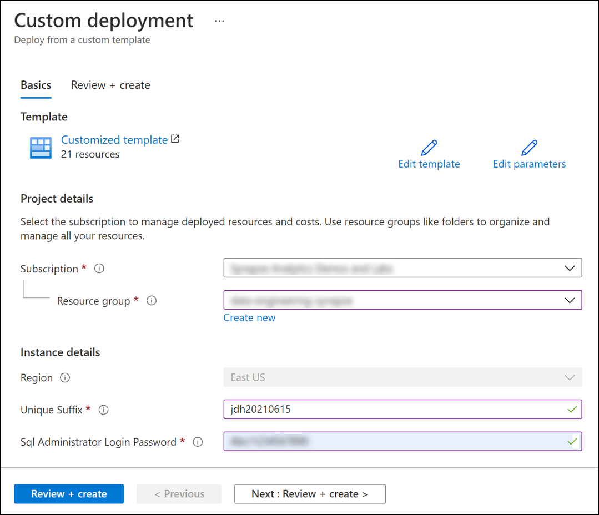

3. Select the **Review + create** button, then **Create**. The provisioning of your deployment resources will take approximately 6 minutes.

    During workspace creation, the portal displays the Submitting deployment for Azure Databricks tile on the right side. You may need to scroll right on your dashboard to see the tile. There is also a progress bar displayed near the top of the screen. You can watch either area for progress.

    > **Note**: You may experience a deployment step failing in regards to Role Assignment. This error may safely be ignored.

## Exercise 2: Setup Synapse Analytics workspace

The entire script will take about 15 minutes to complete. Major steps include:

- Configure Synapse resources
- Download all data sets and files into the data lake (~5 mins)
- Execute the Cosmos DB pipeline (~10 mins)

### Task 1: Pre-requisites

Install these pre-requisites on your **deployment VM** before continuing.

- Install VC Redist: <https://aka.ms/vs/15/release/vc_redist.x64.exe>
- Install MS ODBC Driver 17 for SQL Server: <https://www.microsoft.com/download/confirmation.aspx?id=56567>
- Install SQL CMD x64: <https://go.microsoft.com/fwlink/?linkid=2082790>
- Install Microsoft Online Services Sign-In Assistant for IT Professionals RTW: <https://www.microsoft.com/download/details.aspx?id=28177>
- Install [Git client](https://git-scm.com/downloads) accepting all the default options in the setup.
- [Windows PowerShell](https://docs.microsoft.com/powershell/scripting/windows-powershell/install/installing-windows-powershell?view=powershell-7)

### Task 2: Download artifacts and install PowerShell modules

Perform all of the steps below from your **deployment VM**:

1. Open a PowerShell Window as an administrator, run the following command to download the artifacts

    ```powershell
    mkdir c:\labfiles

    cd c:\labfiles

    git clone https://github.com/solliancenet/dp-203-v2.git data-engineering-ilt-deployment
    ```

2. Install Azure PowerShell module

    Open Windows PowerShell as an Administrator on your desktop and execute the following:

    ```powershell
    if (Get-Module -Name AzureRM -ListAvailable) {
        Write-Warning -Message 'Az module not installed. Having both the AzureRM and Az modules installed at the same time is not supported.'
        Uninstall-AzureRm -ea SilentlyContinue
        Install-Module -Name Az -AllowClobber -Scope CurrentUser
    } else {
        Install-Module -Name Az -AllowClobber -Scope CurrentUser
    }
    ```

    > [!Note]: You may be prompted to install NuGet providers, and receive a prompt that you are installing the module from an untrusted repository. Select **Yes** in both instances to proceed with the setup

3. Install `Az.CosmosDB` module

    ```powershell
    Install-Module -Name Az.CosmosDB -AllowClobber
    ```

    > [!Note]: If you receive a prompt that you are installing the module from an untrusted repository, select **Yes to All** to proceed with the setup.

4. Install `sqlserver` module

    ```powershell
    Install-Module -Name SqlServer -AllowClobber
    ```

5. Install Azure CLI

    ```powershell
    Invoke-WebRequest -Uri https://aka.ms/installazurecliwindows -OutFile .\AzureCLI.msi; Start-Process msiexec.exe -Wait -ArgumentList '/I AzureCLI.msi /quiet'; rm .\AzureCLI.msi
    ```

**IMPORTANT**

- Once the last command has completed, **close the Windows PowerShell window** so you can import the newly installed Az.CosmosDB cmdlet.

### Task 3: Execute setup scripts

Time to complete: 15 minutes

Perform all of the steps below from your **deployment VM**:

1. **Important step:** Go back to the Azure portal to make sure the **ARM template deployment has completed**. If it has not, these scripts will fail. *Wait until the deployment successfully completes*.

2. Open Windows PowerShell as an Administrator and execute the following to set the `PSGallery` as a trusted repository:

    ```powershell
    Set-PSRepository -Name "PSGallery" -InstallationPolicy Trusted
    ```

3. Execute the following to set the execution policy to Unrestricted so you can run the local PowerShell script file:

    ```powershell
    Set-ExecutionPolicy Unrestricted
    ```

    > [!Note]: If you receive a prompt that you are installing the module from an untrusted repository, select **Yes to All** to proceed with the setup.

4. Execute the following to import the `Az.CosmosDB` module:

    ```powershell
    Import-Module Az.CosmosDB
    ```

5. Change directories to the root of this repo within your local file system.

    ```powershell
    cd C:\labfiles\data-engineering-ilt-deployment\Instructions\Labs\00\artifacts\environment-setup\automation\
    ```

6. Execute `Connect-AzAccount` and sign in to your Microsoft user account when prompted.

    > [!WARNING]: You may receive the message "TenantId 'xxxxxx-xxxx-xxxx-xxxx' contains more than one active subscription. The first one will be selected for further use. You can ignore this at this point. When you execute the environment setup, you will choose the subscription in which you deployed the environment resources.

7. Execute `.\01-environment-setup.ps1`

   1. You will be prompted to setup your Azure PowerShell and Azure CLI context.

   2. If you have more than one Azure Subscription, you will be prompted to enter the name of your desired Azure Subscription. You can copy and paste the value from the list to select one. For example:

       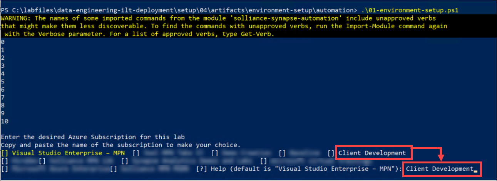

   3. Enter the name of the resource group you created at the beginning of the environment setup (such as `data-engineering-synapse`). This will make sure automation runs against the correct environment you provisioned in Azure.

       > **NOTE** This script will take about 15-20 minutes to complete.

### Task 4: Create an Azure Databricks cluster

Time to complete: 5 minutes

1. While the PowerShell script executes, go back to the Azure portal. Navigate to your Azure resource group for this lab, then select the Azure Databricks workspace.

    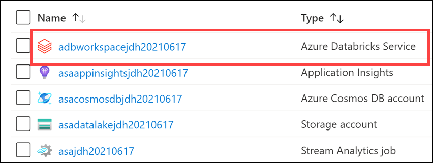

2. Select **Launch Workspace** to open your Databricks workspace in a new tab.

    

3. In the left-hand menu of your Databricks workspace, select **Compute**.
4. Select **Create Cluster** to add a new cluster.

    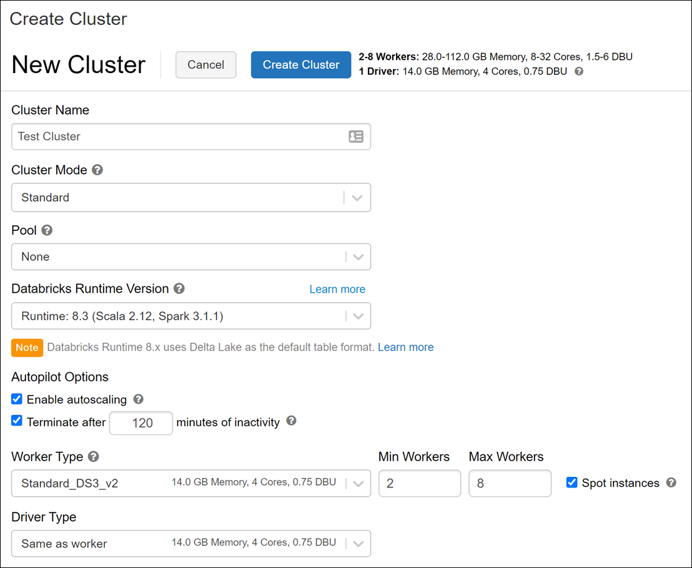

5. Enter a name for your cluster, such as `Test Cluster`.
6. Select the **Databricks RuntimeVersion**. We recommend the latest runtime and **Scala 2.12**.
7. Select the default values for the cluster configuration.
8. Check **Spot instances** to optimize costs.
9. Select **Create Cluster**.
