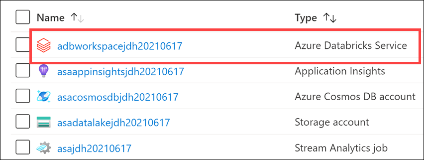

# Module 0 - Lab environment setup

Time to complete: 56 minutes

The following instructions enables learners to prepare their lab environments for the modules that follow. Please run through these instructions prior to starting Module 1. These instructions are provided on the assumption you will be using a pre-installed virtual machine provided for the course. If you do not have a pre-installed virtual machine provided, you can use the [following instructions](FullSetupREADME.md) to setup the course.

## Lab details

- [Module 0 - Lab environment setup](#module-0---lab-environment-setup)
  - [Lab details](#lab-details)
  - [Requirements](#requirements)
  - [Exercise 1: Azure setup](#exercise-1-azure-setup)
    - [Task 1: Register resource providers](#task-1-register-resource-providers)
    - [Task 2: Create a resource group in Azure](#task-2-create-a-resource-group-in-azure)
    - [Task 3: Create Azure resources](#task-3-create-azure-resources)
  - [Exercise 2: Setup Synapse Analytics workspace](#exercise-2-setup-synapse-analytics-workspace)
    - [Task 1: Execute setup scripts](#task-1-execute-setup-scripts)
    - [Task 2: Create an Azure Databricks cluster](#task-2-create-an-azure-databricks-cluster)

## Requirements

1. An Azure Account with the ability to create an Azure Synapse Workspace

## Exercise 1: Azure setup

Time to complete: 27 minutes

### Task 1: Register resource providers

Time to complete: 10 minutes

In Azure, you must register specific resource providers on your subscription before you can deploy services such as Synapse Analytics and Azure Databricks.

1. Log in to the Azure portal (<https://portal.azure.com>).

2. In the search bar on top of the page, type `subscriptions` and select **Subscriptions** in the results.

    

3. Select the Azure subscription you will use for your lab environment. If you are using an Azure Pass, the sucscription is called "**Azure Pass - Sponsorship**".

    

4. Select **Resource providers** in the left-hand menu.

    

5. In the **filter**, type `databricks` to view the **Microsoft.Databricks** provider. Make sure the status is set to **Registered**.

    

    If it is **not** registered, select the **Microsoft.Databricks** resource provider, then select **Register**.

    

6. In the **filter**, type `synapse` to view the **Microsoft.Synapse** provider. Make sure the status is set to **Registered**.

    

    If it is **not** registered, select the **Microsoft.Synapse** resource provider, then select **Register**.

    

7. In the **filter**, type `sql` to view the **Microsoft.Sql** provider. Make sure the status is set to **Registered**.

    

    If it is **not** registered, select the **Microsoft.Sql** resource provider, then select **Register**.

    

8. In the **filter**, type `document` to view the **Microsoft.DocumentDB** provider. Make sure the status is set to **Registered**.

    

    If it is **not** registered, select the **Microsoft.DocumentDB** resource provider, then select **Register**.

    

9. In the **filter**, type `stream` to view the **Microsoft.StreamAnalytics** provider. Make sure the status is set to **Registered**.

    

    If it is **not** registered, select the **Microsoft.StreamAnalytics** resource provider, then select **Register**.

    

10. In the **filter**, type `event` to view the **Microsoft.EventHub** provider. Make sure the status is set to **Registered**.

    

    If it is **not** registered, select the **Microsoft.EventHub** resource provider, then select **Register**.

    

11. In the **filter**, type `keyvault` to view the **Microsoft.KeyVault** provider. Make sure the status is set to **Registered**.

    

    If it is **not** registered, select the **Microsoft.KeyVault** resource provider, then select **Register**.

    

12. In the **filter**, type `storage` to view the **Microsoft.Storage** provider. Make sure the status is set to **Registered**.

    

    If it is **not** registered, select the **Microsoft.Storage** resource provider, then select **Register**.

    

13. In the **filter**, type `compute` to view the **Microsoft.Compute** provider. Make sure the status is set to **Registered**.

    

    If it is **not** registered, select the **Microsoft.Compute** resource provider, then select **Register**.

    

### Task 2: Create a resource group in Azure

Time to complete: 3 minutes

1. Log into the [Azure Portal](https://portal.azure.com) using your Azure credentials.

2. On the Azure Portal home screen, select the **Menu** button on the top-left corner **(1)**. Hover over **Resource groups (2)**, then select **+ Create (3)**.

    

3. On the **Create a resource group** screen, select your desired Subscription and Region. For Resource group, enter **`data-engineering-synapse`** (make sure the name is unique), then select the **Review + Create** button. **Copy the resource group name** and save it in Notepad or similar for later reference.

    

4. Select the **Create** button once validation has passed.

> **Important**: Take note of the _exact_ resource group name you provided for the steps that follow.
### Task 3: Create Azure resources

Time to complete: 14 minutes

The below ARM template deploys several Azure resources for the labs, including Azure Synapse Analytics, Azure Databricks, storage accounts, Event Hubs, Stream Analytics, Key Vault, Azure Cosmos DB, etc.

1. Deploy the workspace through the following Azure ARM template (select the button below):

    <a href="https://portal.azure.com/#create/Microsoft.Template/uri/https%3A%2F%2Fraw.githubusercontent.com%2Fsolliancenet%2FDP-203T00-Data-Engineering-on-Microsoft-Azure%2Foptimizations%2FInstructions%2FLabs%2F00%2Fartifacts%2Fenvironment-setup%2fautomation%2F00-asa-workspace-core.json" target="_blank"></a>

2. On the **Custom deployment** form fill in the fields described below.

   - **Subscription**: Select the **`Azure Pass - Sponsorship`** subscription for the deployment.
   - **Resource group**: Select the resource group **`data-engineering-synapse`**.
   - **Region**: The region where your Azure Synapse environment will be created.

        > **Important**: The `Region` field under 'Parameters' will list the Azure regions where Azure Synapse Analytics is available as of November 2020. This will help you find a region where the service is available without being limited to where the resource group is defined.

   - **Unique Suffix**: This unique suffix will be used naming resources that will created as part of your deployment, such as your initials followed by the current date in YYYYMMDD format (ex. `jdh20210615`). Make sure you follow correct Azure [Resource naming](https://docs.microsoft.com/en-us/azure/cloud-adoption-framework/ready/azure-best-practices/naming-and-tagging#resource-naming) conventions.
   - **SQL Administrator Login Password**: Provide a strong password for the SQLPool that will be created as part of your deployment. [Visit here](https://docs.microsoft.com/en-us/sql/relational-databases/security/password-policy?view=sql-server-ver15#password-complexity) to read about password rules in place. Your password will be needed during the next steps. Make sure you have your password noted and secured.

   

3. Select the **Review + create** button, then **Create**. The provisioning of your deployment resources will take approximately 7 minutes.

    During workspace creation, the portal displays the Submitting deployment for Azure Databricks tile on the right side. You may need to scroll right on your dashboard to see the tile. There is also a progress bar displayed near the top of the screen. You can watch either area for progress.

    > **Note**: You may experience a deployment step failing in regards to Role Assignment. This error may safely be ignored.

## Exercise 2: Setup Synapse Analytics workspace

Time to complete: 29 minutes
### Task 1: Execute setup scripts

Time to complete: 20 minutes

Perform all of the steps below from your Virtual Machine:

1. **Important step:** Make sure the **ARM template deployment has completed**. If it has not, these scripts will fail. *Wait until the deployment successfully completes*.

2. Open Windows PowerShell as an Administrator and execute the following to set the `PSGallery` as a trusted repository:

    ```powershell
    Set-PSRepository -Name "PSGallery" -InstallationPolicy Trusted
    ```

3. Execute the following to set the execution policy to Unrestricted so you can run the local PowerShell script file:

    ```powershell
    Set-ExecutionPolicy Unrestricted
    ```

    > [!Note]: If you receive a prompt that you are installing the module from an untrusted repository, select **Yes to All** to proceed with the setup.

4. Execute the following to import the `Az.CosmosDB` module:

    ```powershell
    Import-Module Az.CosmosDB
    ```

5. Change directories to the root of this repo within your local file system.

    ```powershell
    cd C:\labfiles\data-engineering-ilt-deployment\Instructions\Labs\00\artifacts\environment-setup\automation\
    ```

6. Execute `Connect-AzAccount` and sign in to your Microsoft user account when prompted.

7. You will receive the message "TenantId 'xxxxxx-xxxx-xxxx-xxxx' contains more than one active subscription. The first one will be selected for further use. **Copy the tenant id** so that you can paste it into the next command.

8. Execute `az login --tenant <<tenant id>>` and paste the tenant id from the previous step. You will be directed to the browser to sign into your Azure account. Once you have signd in, move to the next step.

9. Execute `.\01-environment-setup.ps1`

   1. If you have more than one Azure Subscription, you will be prompted to enter the name of your desired Azure Subscription. Copy and paste the value `Azure Pass - Sponsorship` from the list to select one. For example:

       

        > [!WARNING]: You may receive the message "Unable to acquire token for tenant...". This can be safely ignored.

   3. Enter the name of the resource group named `data-engineering-synapse`. This will make sure automation runs against the correct environment you provisioned in Azure.

       > **NOTE** This script will take about 15-20 minutes to complete. Move onto the next task while this script is executing

### Task 2: Create an Azure Databricks cluster

Time to complete: 9 minutes

1. While the PowerShell script executes, go back to the Azure portal. Navigate to your Azure resource group for this lab, then select the Azure Databricks workspace.

    

2. Select **Launch Workspace** to open your Databricks workspace in a new tab.

    

3. In the left-hand menu of your Databricks workspace, select **Compute**.
4. Select **Create Cluster** to add a new cluster.

    

5. Enter a name for your cluster, such as `Test Cluster`.
6. Select the **Databricks RuntimeVersion**. We recommend the latest runtime and **Scala 2.12**.
7. Select the default values for the cluster configuration.
8. Check **Spot instances** to optimize costs.
9. Select **Create Cluster**.
